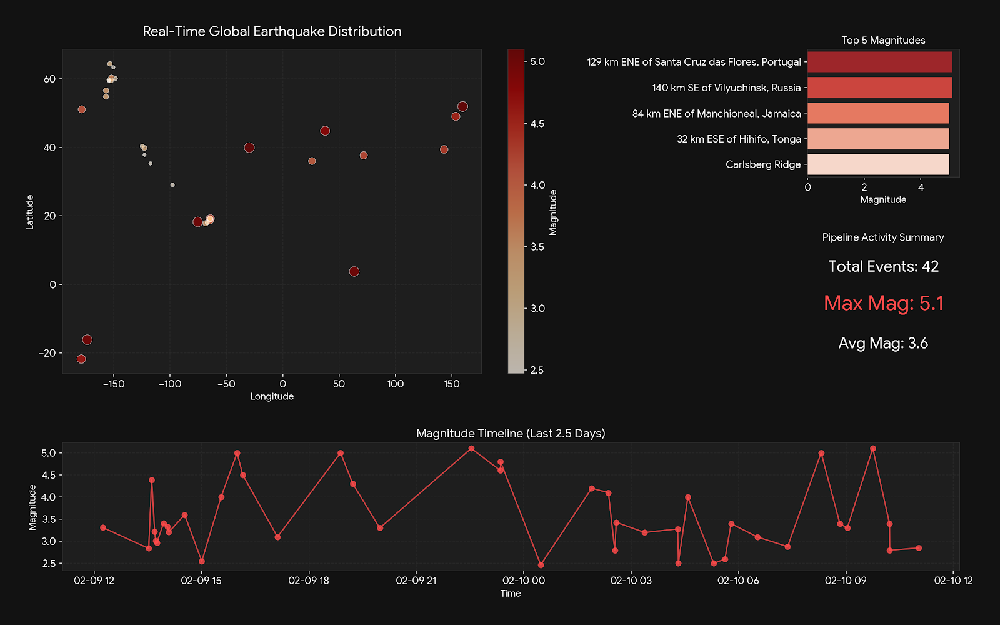

# 🌍 QuakeStream: Real-Time Earthquake CDC & Analytics Pipeline

**QuakeStream** is a production-grade data engineering solution that implements **Change Data Capture (CDC)** to stream global seismic activity from the USGS API into an analytical ecosystem. It bridges the gap between high-frequency transactional ingestion and real-time geospatial visualization, ensuring zero data loss and sub-second latency.



---

## 🎯 Project Goal
To provide a demonstrable, end-to-end solution for high-velocity data integration. This project focuses on moving beyond traditional batch polling into a modern streaming paradigm where every database change is captured as a first-class event using **Debezium** and **Apache Kafka**.

---

## 🧬 System Architecture
The pipeline follows a modular "Ingest-Stream-Sync-Visualize" logic:

1.  **Ingestion (The Poller):** A Python worker polls the USGS API and performs upserts into the **Source Database**.
2.  **Capture (CDC):** **Debezium** monitors the PostgreSQL **Write-Ahead Log (WAL)**, capturing row-level changes instantly.
3.  **Transport (Kafka):** Events are serialized into JSON and stored in **Kafka** topics, providing a fault-tolerant buffer.
4.  **Sinking (JDBC):** A **Kafka Connect JDBC Sink** consumes events and replicates them into a dedicated **Analytical Sink Database**.
5.  **BI Layer:** **Grafana** performs real-time geospatial queries against the Sink DB for live monitoring.


---

## 🛠️ Technical Stack
| Layer | Tools | Purpose |
| :--- | :--- | :--- |
| **Ingestion** | Python 3.11, Requests | API polling and source database hydration |
| **Message Broker** | Apache Kafka, Zookeeper | Event streaming and asynchronous buffering |
| **CDC Engine** | Debezium (PostgreSQL) | Log-based Change Data Capture |
| **Databases** | PostgreSQL 16 (Source & Sink) | Transactional and Analytical storage |
| **Orchestration** | Docker, Docker Compose | Full-stack containerized deployment |
| **Visualization** | Grafana | Real-time geospatial mapping and analytics |

---

## 📊 Performance & Results
* **Real-World Data:** Successfully ingested and visualized 42+ actual seismic events from the USGS 2.5-day feed.
* **Latency:** Achieved near real-time propagation from Source to Sink (Avg < 500ms).
* **Data Integrity:** Implemented custom JDBC dialect overrides (`stringtype=unspecified`) to handle complex timestamp casting between JSON and SQL.
* **Fault Tolerance:** Validated that the pipeline resumes from the exact last offset after service downtime, preventing data loss.

---

## 📂 Project Structure
```text
QuakeStream/
├── connect/
│   └── Dockerfile            # Kafka Connect + Debezium + JDBC Plugins
├── connectors/
│   ├── debezium-source.json  # CDC Source Configuration
│   └── jdbc-sink.json        # Analytical Sink Configuration
├── grafana/
│   ├── dashboards/           # Auto-provisioned JSON dashboards
│   └── provisioning/         # Datasource & Dashboard auto-configs
├── poller/
│   ├── poller.py             # Python USGS polling loop
│   └── Dockerfile            # Python environment
├── sql/
│   ├── init_source.sql       # WAL & Replication Slot setup
│   └── init_sink.sql         # Target schema DDL
├── docker-compose.yml        # Full-stack orchestration
└── README.md
```

---

## ⚙️ Installation & Setup

### 1. Clone & Build
```bash
git clone [https://github.com/declerke/QuakeStream.git](https://github.com/declerke/QuakeStream.git)
cd QuakeStream
docker compose build --no-cache
docker compose up -d
```

### 2. Deploy Connectors
Execute the deployment script to initialize the streaming pipes:
```bash
chmod +x scripts/deploy_connectors.sh
./scripts/deploy_connectors.sh
```

### 3. View Analytics
Access the real-time dashboard at `http://localhost:3000` (User: `admin` | Pass: `admin`).

---

## 🎓 Skills Demonstrated
* **Database Internals:** Configuration of PostgreSQL Logical Replication and WAL monitoring.
* **Streaming Systems:** Management of Kafka topics and Kafka Connect worker lifecycles.
* **Data Transformation:** Utilizing Single Message Transforms (SMT) to extract new record states from CDC envelopes.
* **Infrastructure-as-Code:** Automating a complex 7-service distributed system for one-click deployment.
